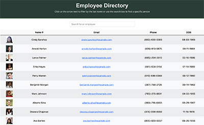

# Employee Directory

## Table of Contents

- [Description](#description)
- [Installation](#installation)
- [Usage](#usage)
- [License](#license)
- [Tests](#tests)
- [Links](#links)
- [Contributors](#contributors)
- [Questions](#questions)

## Description

An employee directory that can be searched by name. The directory will display non-sensitive information.

## Installation

To install the required dependencies, run the following command:
npm i

## Usage

The application is an employee directory that was built using React. The user can type in a name to search for a specific person or they can use the arrow next to name to sort the employees alphabetically.

## License

The project is licensed under the MIT license.

## Tests

Please run the following command to test:
NA

## Links

https://calliebn.github.io/employee_directory/

## Contributors

Callie Nipper

## Questions?

Please email callie.nipper@gmail.com with any questions.
Visit me on GitHub at https://github.com/calliebn
